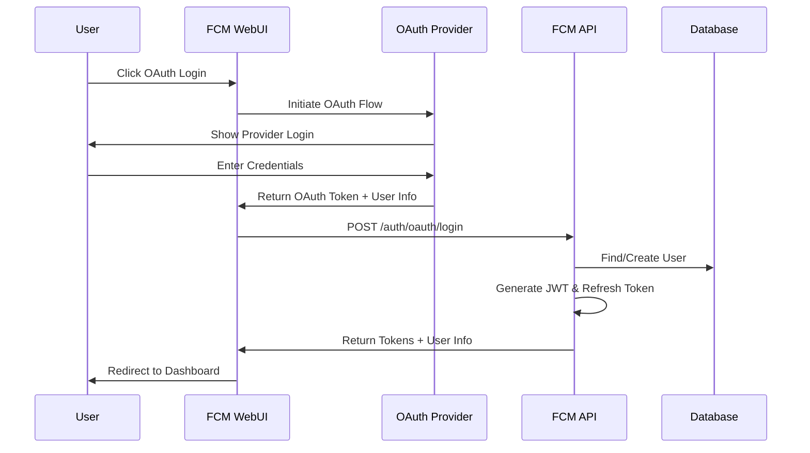
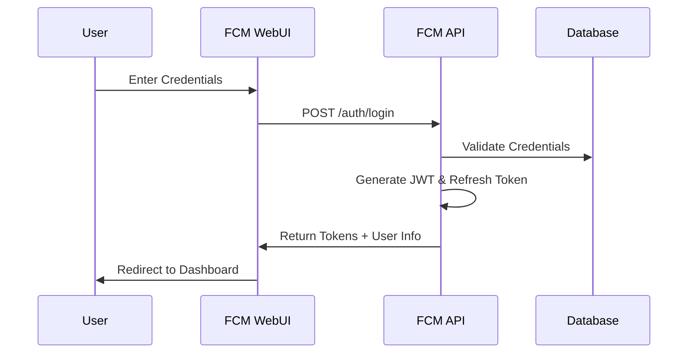
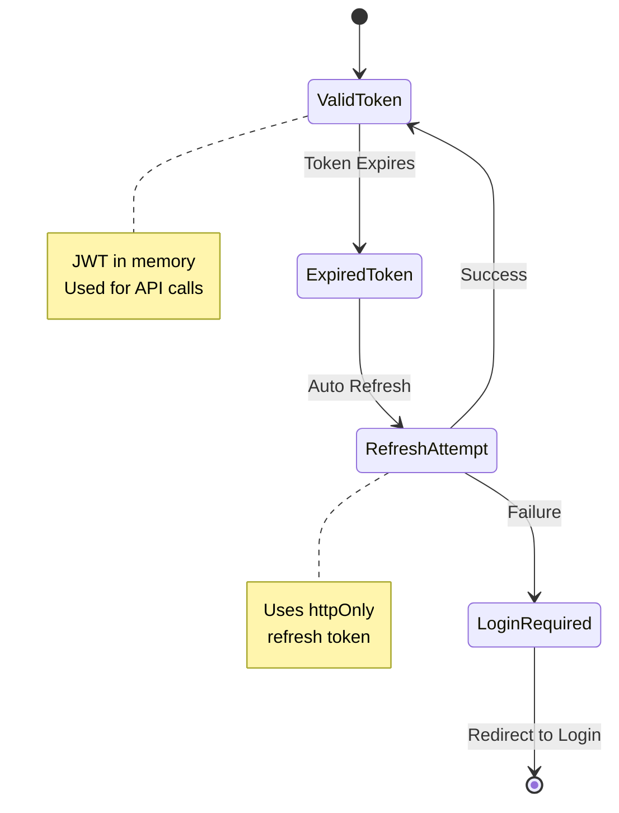
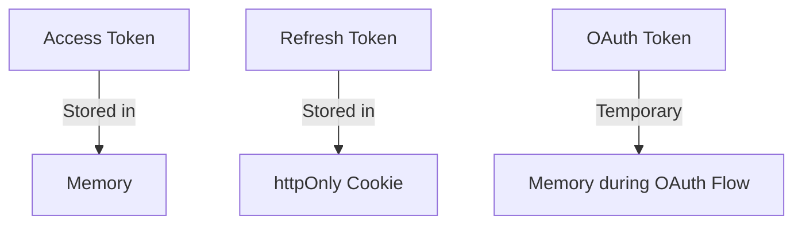
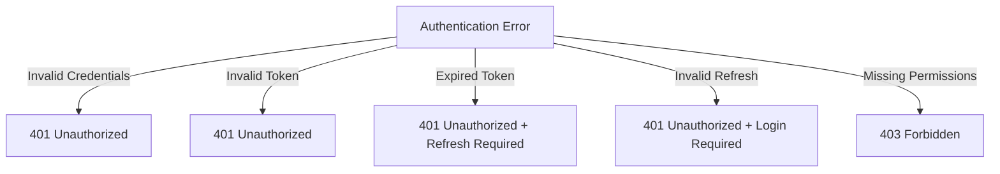

# Flight Cost Monitor Authentication Documentation

## Overview
Flight Cost Monitor (FCM) supports two main authentication methods:
1. OAuth authentication (GitHub, Google)
2. Credentials-based authentication

## Authentication Flows

### 1. OAuth Authentication Flow

### 2. Credentials Authentication Flow

### 3. Token Refresh Flow

## Authentication Components

### 1. Token Structure

#### Access Token (JWT)
\`\`\`typescript
interface TokenPayload {
    sub: string;           // User ID
    email: string;
    authType: string;      // 'CREDENTIALS' | 'OAUTH'
    roles: string[];
    iat: number;
    exp: number;
}
\`\`\`

#### Refresh Token
\`\`\`typescript
interface RefreshToken {
    id: string;
    token: string;
    userId: string;
    expiresAt: Date;
    family: string;        // For token rotation
    generationNumber: number;
}
\`\`\`

### 2. API Endpoints

#### OAuth Authentication
- \`POST /auth/oauth/login\`: Exchange OAuth token for JWT
- \`POST /auth/oauth/github\`: GitHub OAuth callback
- \`POST /auth/oauth/google\`: Google OAuth callback

#### Credentials Authentication
- \`POST /auth/login\`: Login with username/password
- \`POST /auth/register\`: Register new user
- \`POST /auth/forgot-password\`: Request password reset
- \`POST /auth/reset-password\`: Reset password with token

#### Token Management
- \`POST /auth/refresh\`: Refresh access token
- \`POST /auth/logout\`: Logout and invalidate tokens

### 3. Security Measures

#### Token Storage

#### Security Features
1. Token Rotation
   - New refresh token family on login
   - Generation number increments on refresh
   - Family invalidation on suspected breach

2. CSRF Protection
   - SameSite cookie policy
   - CSRF tokens for mutations
   - Origin validation

3. Rate Limiting
   - Login attempts limited
   - Token refresh rate limited
   - IP-based throttling

## Implementation Example

### Frontend Usage
\`\`\`typescript
// OAuth Login
const handleOAuthLogin = async (provider: 'github' | 'google') => {
  const tokens = await authService.loginWithOAuth(provider);
  await tokenStorage.setTokens(tokens);
};

// Credentials Login
const handleLogin = async (credentials: LoginCredentials) => {
  const tokens = await authService.login(credentials);
  await tokenStorage.setTokens(tokens);
};

// API Call with Auth
const makeAuthenticatedCall = async () => {
  const token = await tokenStorage.getAccessToken();
  return api.call('/protected-endpoint', {
    headers: { Authorization: \`Bearer \${token}\` }
  });
};
\`\`\`

### Backend Validation
\`\`\`typescript
// Token Validation
@Injectable()
export class AuthGuard implements CanActivate {
  async canActivate(context: ExecutionContext) {
    const token = this.extractToken(context);
    if (!token) return false;
    
    try {
      const payload = await this.jwtService.verify(token);
      return this.validatePayload(payload);
    } catch {
      return false;
    }
  }
}

// Role-Based Access
@Injectable()
export class RolesGuard implements CanActivate {
  async canActivate(context: ExecutionContext) {
    const roles = this.reflector.get<string[]>('roles', context.getHandler());
    const user = context.switchToHttp().getRequest().user;
    
    return this.matchRoles(roles, user.roles);
  }
}
\`\`\`

## Security Considerations

### Token Lifecycle
1. Access tokens expire in 15 minutes
2. Refresh tokens expire in 7 days
3. Tokens are invalidated on logout
4. Compromised tokens can be revoked

### Best Practices
1. Always use HTTPS
2. Implement proper CORS policies
3. Validate all user input
4. Monitor failed login attempts
5. Log security-relevant events

## Error Handling

